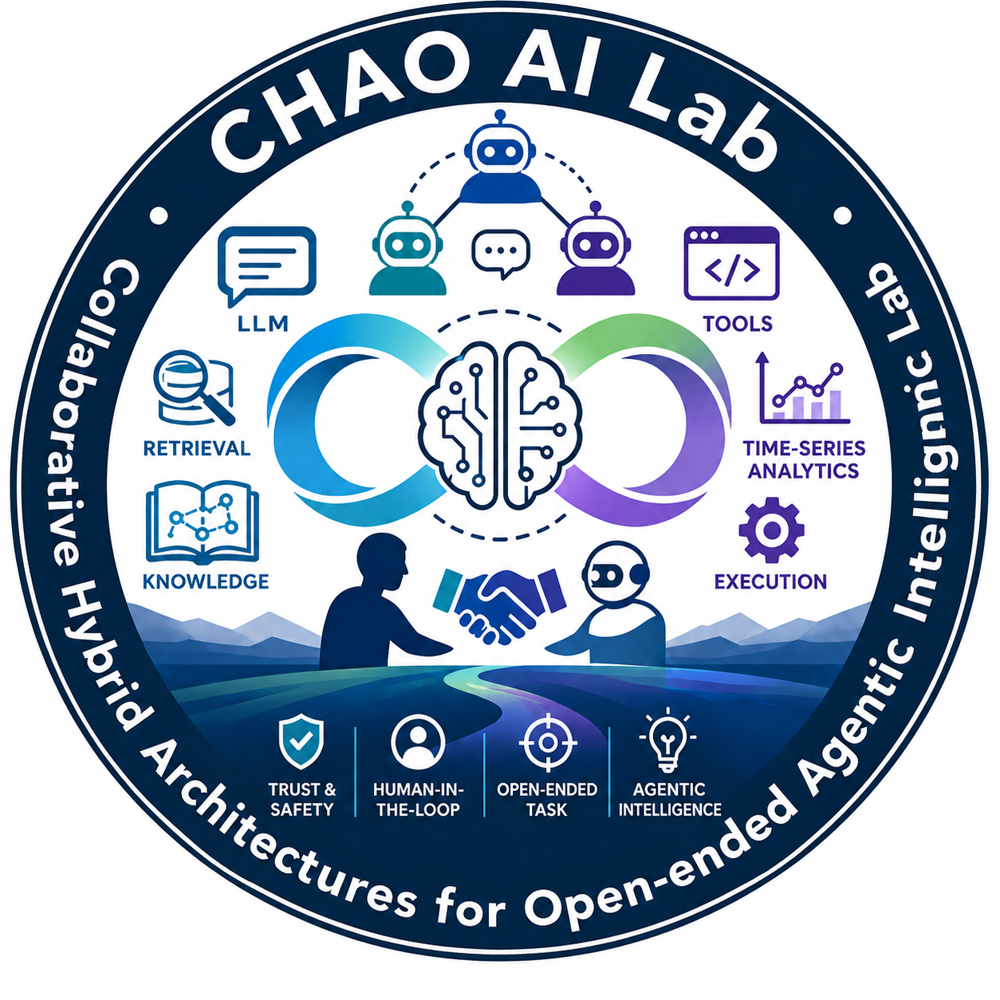

  
  <h1>面向开放式智能体智能的协同混合架构实验室（CHAO-AI Lab）</h1>
  
  **Language / 语言切换**: [English](./README.md) | [中文](./README_ZH.md)

**CHAO-AI Lab**，全称为 **Collaborative Hybrid Architectures for Open-ended Agentic Intelligence Lab**，中文译为**面向开放式智能体智能的协同混合架构实验室**，由 WangChao 教授领导。实验室聚焦大语言模型、智能体系统、多智能体交互、检索增强、自然语言处理与时序数据分析等方向，致力于构建能够在复杂真实场景中**协同工作、混合组合、开放求解**的新一代 AI 系统。

我们认为，下一代人工智能的突破不会仅来自单一模型或单一算法，而来自**系统级架构的设计**——让大模型、工具、数据、知识、人类与多智能体协同运作。CHAO-AI Lab 的目标，是研究并构建这样一套既具备认知能力又具备行动能力的智能体系统，使其能够理解语言、检索知识、分析数据、长程推理、人机协同，并在开放式任务中稳定可靠地执行。

## **研究愿景**

我们的研究围绕实验室名称中的三个核心词展开：

**Collaborative（协同）。** 真正的智能来自协同：人与 AI 之间的协同、多智能体之间的协同、以及模型、工具与数据系统之间的协同。我们研究如何设计高效、可控、可信的交互协议、通信机制和协作策略，让协同成为新一代 AI 系统的内建能力。

**Hybrid（混合）。** 真实世界的智能需要异构能力的融合：大语言模型、检索系统、结构化知识、工具调用、代码执行、时间序列分析与传统机器学习方法。我们关注如何将这些组件组织成有机的混合架构，让每一种技术发挥其最适合的作用。

**Architectures for Open-ended Agentic Intelligence（面向开放式智能体智能的架构）。** 我们聚焦的是架构，而非孤立的技巧——让智能体能够在任务边界不清、环境持续变化、信息不完整的开放式场景中，规划、检索、分析、决策并行动。我们追求的是一种真正具备**智能体智能**的 AI 系统，服务于复杂的人类目标。

## **研究方向**

**大语言模型与基础推理。** 大模型在复杂任务中的推理、规划、长上下文理解、知识融合与能力评测。

**智能体 AI 与工具使用。** 基于 LLM 的智能体架构，包括任务规划、记忆、反思、工具调用、代码执行、浏览器交互与长程任务完成。

**多智能体系统与交互。** 多智能体之间的通信、协作、角色分工、辩论与博弈，及其在研究、分析与决策辅助中的应用。

**检索增强与知识增强系统。** 信息检索、检索增强生成、结构化知识融合，以及让智能体行为可被可信信息源支撑。

**自然语言处理。** 语言理解、信息抽取、语义表示，以及面向智能体系统的自然语言接口。

**时序数据挖掘与数据分析。** 时间序列与多源数据的建模、挖掘与分析，并将分析能力深度融入智能体工作流。

**人机协同与可信智能体。** 人在环系统设计、可控智能体、用户意图对齐，以及在开放式场景中实现可解释、可靠的智能体行为。

## **核心问题**

如何让大语言模型变成在开放式环境中长程、安全、可靠运行的智能体？

如何设计将 LLM、检索、工具、知识与分析能力有机融合的混合架构，使整体能力大于各部分之和？

多个智能体之间如何通过通信、协作与角色分工，去解决任何单个智能体都无法独立完成的复杂问题？

人类与 AI 智能体如何在研究、分析与决策过程中协同工作，同时保持人类的知情权与控制权？

如何让智能体真正理解时序与分析型数据，而不仅仅是文本，并把原始数据转化为可信的洞察？

## **关键目标**

让模型、智能体、工具、数据与人类共同构建下一代 AI 系统。

